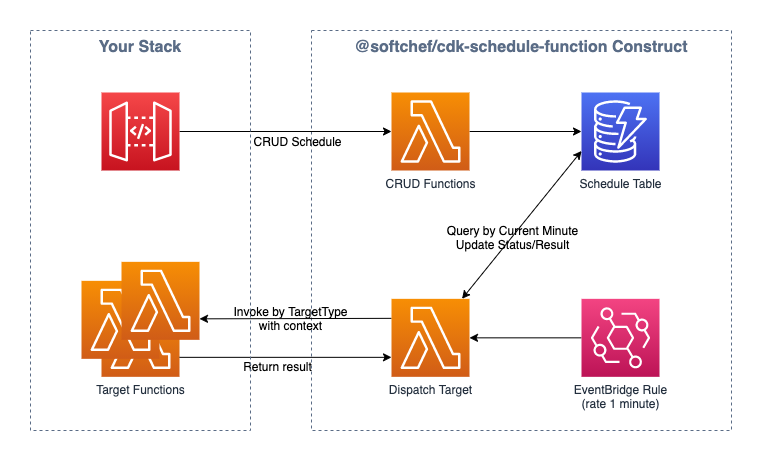

# CDK Construct - Schedule Function

[](https://badge.fury.io/js/%40softchef%2Fcdk-schedule-function)


ScheduleFunction is CDK Construct, provide lambda functions to manage your schedule with Amazon EventBridge service. It is arrange one-time or multi-times schedule to invoke specify lambda functions. It is not permanent recurly, because you can use original EventBridge rule.

You can hook the lambda functions to your API Gateway to manage your schedules. The schedules will store in the DynamoDB table, you can tracking the schedules status, execution results, etc...



---

## Installation

```
npm install @softchef/cdk-schedule-function

or

yarn add @softchef/cdk-schedule-function
```

## Usage

```
const scheduleFunction = new ScheduleFunction(stack, 'ScheduleFunction', {});

scheduleFunction.addTargetFunction('CreateJob', targetFunction);

```

The Target Function is actual to execute function for business logic. The 'CreateJob' is targetType to identify this function when schedule running.

You can add many targetFunction to process different logic.


## Hook

```
const restApi = new apigateway.RestApi(stack, 'RestApi');

const rootResource = restApi.root.addResource('schedules');

rootResource.addMethod('POST', apigateway.LambdaIntegration(scheduleFunction.createScheduleFunction));  // Create schdules
rootResource.addMethod('GET', apigateway.LambdaIntegration(scheduleFunction.listSchedulesFunction));  // List schdules

const scheduleResource = rootResource.addResource('{scheduleId}');

scheduleResource.addMethod('GET', apigateway.LambdaIntegration(scheduleFunction.fetchScheduleFunction));  // Fetch schdule
scheduleResource.addMethod('PUT', apigateway.LambdaIntegration(scheduleFunction.updateSchedulesFunction));  // Update schdule
scheduleResource.addMethod('PUT', apigateway.LambdaIntegration(scheduleFunction.deleteSchedulesFunction));  // Delete schdule

more...
```

## Example

[Demo stack](./src/demo)

## Roadmap

- DispatchTarget performance up(StepFunction or SQS)
- Export more internal resource
- DynamoDB indexs/capacity best optimization
